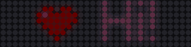

# lite-brite

A battery-powered LED sign for the entryway that shows friendly reminders
from Home Assistant, like "keys away first!" as soon as someone walks in.


*Rendered by the project's simulator, which runs the firmware's own drawing code.*

- **Big, bright, readable:** an 8 × 32 LED ticker (32 × 8 cm) with a
  hand-drawn 7 cm tall font, icons, colors and attention-grabbing effects.
- **Home Assistant decides** what to show and when: any automation can leave
  a message, and the sign creates its own entities over MQTT discovery.
- **Months on a battery:** the sign sleeps at about 35 µA and wakes when its
  motion sensor sees someone, shows what's waiting, and goes back to sleep.



## How it works

```
 Home Assistant                 MQTT broker                     the sign (asleep)
 ─────────────                  ───────────                     ─────────────────
 "she's home" ──► retained ──►  holds the message  ◄── wakes on motion, connects,
  automation      message       until collected        shows it, clears it, sleeps
```

Home Assistant never has to reach the sign directly. Messages wait on the
broker as retained MQTT messages; when someone walks up, the PIR sensor wakes
the sign, which reconnects in a second or two using the Wi-Fi access point it
remembered, collects what's waiting and shows it. It stays connected for a few
seconds more in case Home Assistant is a moment behind, then goes back to deep
sleep. The LED panel's power is switched off entirely whenever nothing is
showing. [docs/power.md](docs/power.md) has the numbers.

## The delivery test

When she arrives home, the sign flashes a large, bright, friendly message
telling her to put her keys away first:

1. Build the sign ([docs/hardware.md](docs/hardware.md)).
2. Flash the firmware (below).
3. Set up Home Assistant and add the keys-away automation
   ([homeassistant/README.md](homeassistant/README.md)).

The automation triggers when her `person` entity changes to `home` and sends
`Welcome home! 🔑 Keys away first 🙂` in orange with the flash effect. When she
opens the door the sign wakes, flashes three times, scrolls the message for
30 seconds and reports back to Home Assistant that it was shown. Other
reminders (trash night, umbrella, packages) work the same way; see
[homeassistant/automations/more_examples.yaml](homeassistant/automations/more_examples.yaml).

## Flashing the firmware

You need [PlatformIO](https://platformio.org/) (the VS Code extension or
`pip install platformio`).

```sh
cd firmware
cp include/secrets.example.h include/secrets.h   # then edit: Wi-Fi, MQTT broker IP and login
pio run -t upload                                # build and flash the XIAO ESP32-S3 over USB
pio device monitor                               # watch it connect (115200 baud)
```

The sign appears in Home Assistant as **Entryway sign**. Pins, panel size and
layout, device name and power thresholds are in
[`firmware/include/config.h`](firmware/include/config.h). Later updates can
go over Wi-Fi: turn on the sign's **Stay awake** switch in Home Assistant, then
`LB_OTA_PASSWORD=... pio run -e xiao_esp32s3_ota -t upload`.

## Repository layout

| Path | What's there |
| --- | --- |
| [`firmware/`](firmware) | PlatformIO project for the ESP32-S3 |
| [`firmware/lib/litebrite_core/`](firmware/lib/litebrite_core) | Hardware-independent core: message format, text layout, font and icons, playback, power limiting, battery and sleep policy, Home Assistant discovery. Unit-tested on your computer. |
| [`firmware/src/`](firmware/src) | The device: wake/connect/show/sleep state machine, LED driver, Wi-Fi, MQTT |
| [`firmware/src/sim/`](firmware/src/sim) | Desktop simulator |
| [`firmware/assets/`](firmware/assets) | The font and icons as editable ASCII art |
| [`homeassistant/`](homeassistant) | Scripts, blueprint, example automations, dashboard card |
| [`docs/`](docs) | [Hardware](docs/hardware.md), [power](docs/power.md), [MQTT API](docs/mqtt-api.md) |
| [`tools/`](tools) | Asset generator and GIF previewer |

## Development

```sh
cd firmware
pio test -e native                  # unit tests for the core, on your computer
pio run -e xiao_esp32s3             # firmware build
pio run -e sim                      # desktop simulator
cd ..
python3 tools/preview.py --out /tmp/test.gif '{"text": "Hi :heart:", "effect": "pulse"}'
python3 tools/gen_assets.py         # after editing firmware/assets/*.txt
```

`tools/preview.py` needs Pillow (`pip install pillow`). CI runs the unit
tests, both firmware builds, the simulator build and an asset freshness
check on every push.

## Status

The firmware builds for the ESP32-S3, and the core logic (text rendering,
message handling, timing, power limiting, battery and sleep decisions, Home
Assistant discovery) is covered by unit tests. It has not yet been run on
real hardware: the first build will be the first real-world test of the LED
timing, the motion wake-up and the battery figures in
[docs/power.md](docs/power.md), which are estimates.
