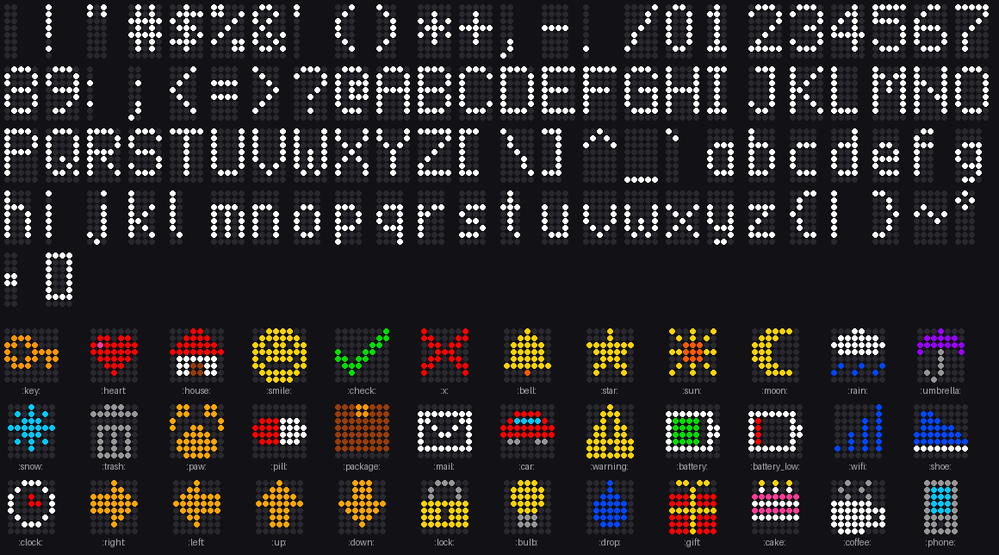

# MQTT API

Everything the sign does is driven by MQTT topics under
`lite-brite/<device>/`, where `<device>` is `LB_DEVICE_ID` (default
`entryway`). Home Assistant's scripts and blueprint wrap all of this, but
anything that speaks MQTT (Node-RED, `mosquitto_pub`, another automation
system) can drive the sign directly.

The sign sleeps most of the time. Anything meant for it is published
**retained**, so the broker holds it until the sign next wakes.

## Topics

| Topic | Direction | Retained | Payload |
| --- | --- | --- | --- |
| `lite-brite/<device>/msg/<slot>` | → sign | yes | A message (below). Empty payload withdraws it. |
| `lite-brite/<device>/config/<setting>` | ↔ | yes | A setting value (below) |
| `lite-brite/<device>/cmd` | → sign | yes | `clear`, `test`, `wiring` or `reboot`. The sign clears it after acting on it. |
| `lite-brite/<device>/state` | sign → | yes | JSON status (below) |
| `lite-brite/<device>/awake` | sign → | yes | `ON` while connected, `OFF` when asleep (also the MQTT last will) |
| `lite-brite/<device>/motion` | sign → | no | `ON` when the motion sensor fires while the sign is awake |
| `lite-brite/<device>/event` | sign → | no | `{"event_type": "shown" \| "expired" \| "invalid", ...}` |
| `lite-brite/<device>/sync` | sign ↔ sign | no | Internal: the sign's marker for "all retained messages received" |
| `homeassistant/device/lite_brite_<device>/config` | sign → | yes | Home Assistant device discovery |

## Messages

One message per **slot** (the last topic segment: 1-32 characters of
`A-Z a-z 0-9 _ -`, not starting with `_`, which is reserved for the sign's own
status messages). Publishing to a slot replaces what's there; different slots
queue up. Publishing an empty retained payload withdraws the message.

The payload is either plain text:

```
Keys away first!
```

or a JSON object:

```json
{
  "text": "Welcome home! :key: Keys away first :smile:",
  "color": "orange",
  "effect": "flash",
  "duration": 30,
  "expires": 1790555700
}
```

| Field | Default | Meaning |
| --- | --- | --- |
| `text` (or `message`) | required | What to show (UTF-8, up to 400 bytes). See [Text markup](#text-markup). |
| `color` | `white` | A name (`red`, `orange`, `amber`, `gold`, `yellow`, `lime`, `green`, `mint`, `teal`, `cyan`, `sky blue`, `blue`, `purple`, `violet`, `lavender`, `magenta`, `pink`, `coral`, `salmon`, `brown`, `white`, `warm white`), `#RRGGBB`, `[r, g, b]`, or `rainbow` |
| `background` (or `bg`) | off | Same forms as `color`. Lighting the whole panel costs a lot more power. |
| `effect` | `scroll` | `scroll`: text that fits sits still in the middle; longer text starts left-aligned so the first words are readable at once, then scrolls (`static` means the same). `flash`: like scroll, with three inverse-video flashes first and one before each repeat. `blink`, `pulse`: blinking or breathing text. `ticker`: everything scrolls in from the right, even short text. |
| `duration` | device setting (30 s) | Seconds to show it. Scrolling text always finishes its pass. |
| `repeat` | | Number of scroll passes instead of a duration |
| `speed` | device setting (24 px/s) | Scroll speed, 5-120 px/s |
| `brightness` | device setting (50 %) | 1-100, perceptual |
| `priority` | `0` | -100 to 100; higher shows first |
| `once` | `true` | Clear the message from the broker after it's been shown. With `false` it shows to every visitor until withdrawn or expired. |
| `when` | `motion` | `motion`: wait until someone is in front of the sign. `now`: show whenever the sign is awake, even without motion (it may be asleep for up to the check-in interval). |
| `expires` | never | Unix time (seconds, or milliseconds), or an ISO-8601 time like `2026-09-27T17:35:00-07:00`. After this the sign drops it and reports `expired`. Needs the sign's clock; see below. |
| `sent` | | When the message was published (same formats). The Home Assistant scripts add it. The sign treats it as "the time is now at least this", which corrects a clock that ran slow in deep sleep and gives it a rough clock when NTP can't be reached. |
| `icon` | | An icon name to put in front of the text |

Unknown fields are ignored and numbers out of range are clamped. A payload the
sign can't use at all (broken JSON, no text) produces an `invalid` event with
the reason, so mistakes show up in Home Assistant.

**The clock and expiry:** the sign sets its clock over NTP (`LB_NTP_SERVER`,
default `pool.ntp.org`; after a failure it waits 2 hours, then 4, 8, 16, and
then retries daily) and from the `sent` time on incoming messages. A clock
that NTP has set is only nudged by `sent` (up to 10 minutes), so a sender
with a wrong clock can't make messages expire early. Until the clock is set, nothing expires. The
state's `clock` field shows whether it's set. If the sign's network has no
internet access, point `LB_NTP_SERVER` at a local NTP server (many routers
run one). Messages carrying `sent` help, but a clock set only from `sent` can
lag behind, so an expired message may still show once.

### Text markup



- `:name:` inserts a built-in icon: `key`, `heart`, `house`, `smile`,
  `check`, `x`, `bell`, `star`, `sun`, `moon`, `rain`, `umbrella`, `snow`,
  `trash`, `paw`, `pill`, `package`, `mail`, `car`, `warning`, `battery`,
  `battery_low`, `wifi`, `shoe`, `clock`, `left`, `right`, `up`, `down`,
  `lock`, `bulb`, `drop`, `gift`, `cake`, `coffee`, `phone` (plus aliases such
  as `keys`, `home`, `love`, `dog`, `meds`). See
  [`firmware/assets/icons.txt`](../firmware/assets/icons.txt).
- The matching emoji work too: 🔑 ❤️ 🏠 🙂 ✅ ❌ 🔔 ⭐ ☀️ 🌙 ☔ ❄️ 🗑️ 🐾 💊 📦 ✉️ 🚗
  ⚠️ 🔋 📶 👟 ⏰ ➡️ 🔒 💡 💧 🎁 🎂 ☕ 📱. Other emoji are dropped.
- `{orange}` switches the color for the text that follows (a name or six hex
  digits like `{ff8800}`); `{}` switches back. `{{` is a literal `{`.
- Accented letters and smart quotes are shown as their plain equivalents
  (`é` → `e`, `’` → `'`); `°` has its own glyph.

## Settings

Each setting is a retained topic that Home Assistant's number and switch
entities both write and display. If a setting has never been set, the sign
publishes its current value when it wakes.

| Setting | Range | Default | |
| --- | --- | --- | --- |
| `brightness` | 1-100 % | 50 | Perceptual brightness |
| `speed` | 5-60 px/s | 24 | Default scroll speed |
| `duration` | 5-300 s | 30 | Default time per message |
| `linger` | 0-120 s | 20 | Stay connected this long after motion or a message |
| `wake_interval` | 5-1440 min | 60 | Battery check-in interval |
| `stay_awake` | `ON`/`OFF` | `OFF` | Stay connected (and accept OTA updates). Turns itself off after 30 minutes on battery. |

## State

```json
{"battery": 87, "voltage": 4.02, "battery_level": "ok", "rssi": -61,
 "wake": "motion", "pending": 1, "usb": false, "wakes": 1234, "clock": true,
 "version": "0.1.0"}
```

`battery_level` is `ok`, `low`, `critical`, `empty` or `unknown`; `wake` is
`power_on`, `motion`, `timer` or `other`.

## Events

```json
{"event_type": "shown", "slot": "keys", "text": "Welcome home! :key: Keys away first :smile:"}
{"event_type": "expired", "slot": "keys", "text": "..."}
{"event_type": "invalid", "slot": "keys", "error": "invalid JSON: IncompleteInput"}
```

## Examples with mosquitto_pub

```sh
H="-h 192.168.1.10 -u lite-brite -P secret"

# Leave a message for the next person who walks in
mosquitto_pub $H -r -t lite-brite/entryway/msg/keys \
  -m '{"text": "Welcome home! :key: Keys away first :smile:", "color": "orange", "effect": "flash"}'

# Take it back
mosquitto_pub $H -r -t lite-brite/entryway/msg/keys -n

# Brightness to 30 %
mosquitto_pub $H -r -t lite-brite/entryway/config/brightness -m 30

# Watch what the sign reports
mosquitto_sub $H -v -t 'lite-brite/entryway/#'
```

## How a wake works

1. Motion (or the check-in timer) wakes the chip from deep sleep.
2. It joins Wi-Fi using the access point and channel remembered from last
   time, then connects to the broker and publishes `awake: ON` and
   `motion: ON`.
3. It subscribes to `msg/+`, `config/+`, `cmd` and `sync`. The broker sends
   every retained message straight away. The sign then publishes a random
   token to `sync`; when that comes back, everything retained has arrived.
4. Messages that may be shown now play in priority order. Each one shown
   produces a `shown` event and, if `once`, an empty retained publish that
   removes it from the broker.
5. It stays connected for `linger` seconds after the last motion or message,
   so a message Home Assistant sends a moment late still gets shown.
6. It publishes its state and `awake: OFF`, waits for the broker to confirm
   (QoS 1), and goes back to deep sleep.
